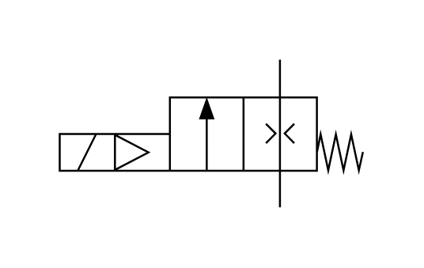

# X10240 Pneumatic soft-start

## Definition

```js
{
  _style: {
    entity: 'verticalLabelPosition=bottom;aspect=fixed;html=1;verticalAlign=top;fillColor=strokeColor;align=center;outlineConnect=0;shape=mxgraph.fluid_power.x10240;points=[[0.725,0,0],[0.725,1,0],[0,0.5,0],[0,0.625,0],[0,0.75,0],[0.28,0.5,0],[0.28,0.75,0],[0.485,0.25,0],[0.485,0.75,0],[0.09,0.5,0],[0.09,0.75,0]]',
  },
  _width: 153.32,
  _height: 74.66,
}
```

## Usage

```js
import { X10240PneumaticSoftStart } from '@dinghy/standard-components-diagrams/fluidPower'

<X10240PneumaticSoftStart/>
```

## Preview


