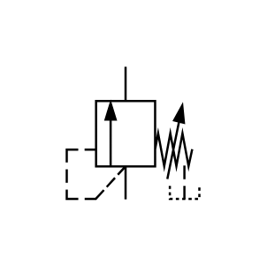

# X10510 Sequence valve

## Definition

```js
{
  _style: {
    entity: 'verticalLabelPosition=bottom;aspect=fixed;html=1;verticalAlign=top;fillColor=strokeColor;align=center;outlineConnect=0;shape=mxgraph.fluid_power.x10510;points=[[0.445,0,0],[0.445,1,0],[0.887,1,0]]',
  },
  _original_width: 83.56,
  _original_height: 75.54,

}
```

## Usage

```js
import { X10510SequenceValve } from '@dinghy/standard-components-diagrams/fluidPower'

<X10510SequenceValve/>
```

## Preview


