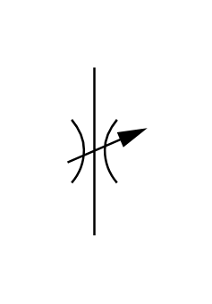

# X10630 Flow-control valve,

## Definition

```js
{
  _style: {
    entity: 'verticalLabelPosition=bottom;aspect=fixed;html=1;verticalAlign=top;fillColor=strokeColor;align=center;outlineConnect=0;shape=mxgraph.fluid_power.x10630;points=[[0.36,0,0],[0.36,1,0]]',
  },
  _width: 33.98,
  _height: 75.14,
}
```

## Usage

```js
import { X10630FlowControlValve } from '@dinghy/standard-components-diagrams/fluidPower'

<X10630FlowControlValve/>
```

## Preview


