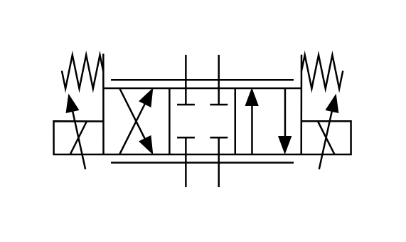

# X10760 Proportional directional

## Definition

```js
{
  _style: {
    entity: 'verticalLabelPosition=bottom;aspect=fixed;html=1;verticalAlign=top;fillColor=strokeColor;align=center;outlineConnect=0;shape=mxgraph.fluid_power.x10760;points=[[0.445,0.01,0],[0.555,0.01,0],[0.445,1,0],[0.555,1,0],[0,0.5,0],[0,0.625,0],[0,0.75,0],[1,0.5,0],[1,0.625,0],[1,0.75,0]]',
  },
  _width: 167.24,
  _height: 75.02,
}
```

## Usage

```js
import { X10760ProportionalDirectional } from '@dinghy/standard-components-diagrams/fluidPower'

<X10760ProportionalDirectional/>
```

## Preview


