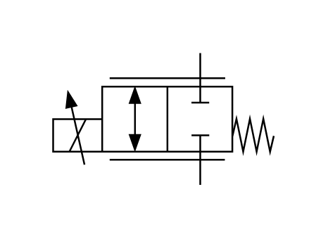

# X10890 Proportional flow-control

## Definition

```js
{
  _style: {
    entity: 'verticalLabelPosition=bottom;aspect=fixed;html=1;verticalAlign=top;fillColor=strokeColor;align=center;outlineConnect=0;shape=mxgraph.fluid_power.x10890;points=[[0.667,0,0],[0.667,1,0]]',
  },
  _width: 125.4,
  _height: 75.02,
}
```

## Usage

```js
import { X10890ProportionalFlowControl } from '@dinghy/standard-components-diagrams/fluidPower'

<X10890ProportionalFlowControl/>
```

## Preview


