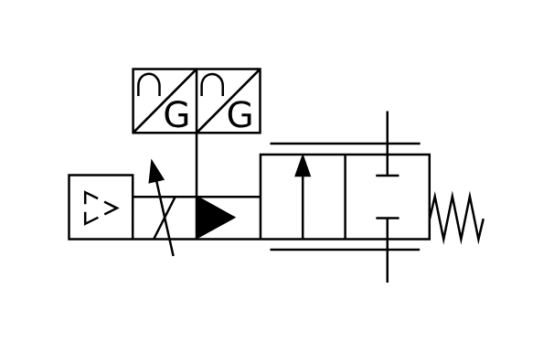

# X10910 Proportional flow-control

## Definition

```js
{
  _style: {
    entity: 'verticalLabelPosition=bottom;aspect=fixed;html=1;verticalAlign=top;fillColor=strokeColor;align=center;outlineConnect=0;shape=mxgraph.fluid_power.x10910;points=[[0.768,0.197,0],[0.768,1,0]]',
  },
  _width: 181.3,
  _height: 93.44,
}
```

## Usage

```js
import { X10910ProportionalFlowControl } from '@dinghy/standard-components-diagrams/fluidPower'

<X10910ProportionalFlowControl/>
```

## Preview


