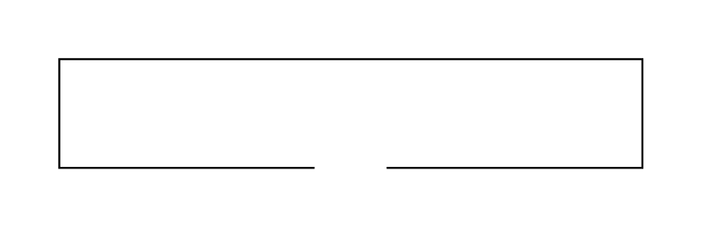

# X11050 Control cover

## Definition

```js
{
  _style: {
    entity: 'verticalLabelPosition=bottom;aspect=fixed;html=1;verticalAlign=top;fillColor=strokeColor;align=center;outlineConnect=0;shape=mxgraph.fluid_power.x11050;',
  },
  _width: 296.94,
  _height: 55.52,
}
```

## Usage

```js
import { X11050ControlCover } from '@dinghy/standard-components-diagrams/fluidPower'

<X11050ControlCover/>
```

## Preview


