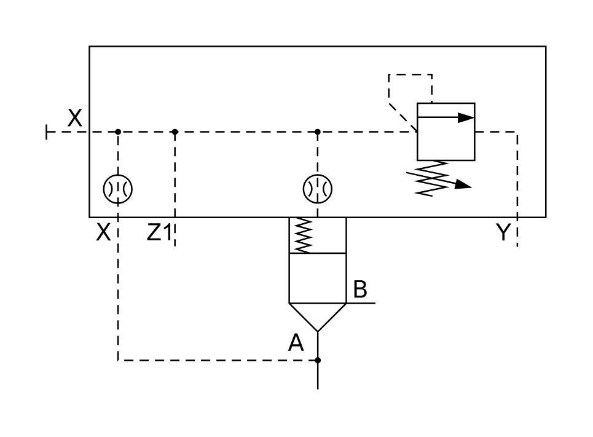

# X11180 Two-port cartridge

## Definition

```js
{
  _style: {
    entity: 'verticalLabelPosition=bottom;aspect=fixed;html=1;verticalAlign=top;fillColor=strokeColor;align=center;outlineConnect=0;shape=mxgraph.fluid_power.x11180;points=[[0,0.25,0],[0.543,1,0],[0.656,0.748,0],[0.943,0.58,0],[0.257,0.58,0]]',
  },
  _width: 325.1,
  _height: 223.22,
}
```

## Usage

```js
import { X11180TwoPortCartridge } from '@dinghy/standard-components-diagrams/fluidPower'

<X11180TwoPortCartridge/>
```

## Preview


