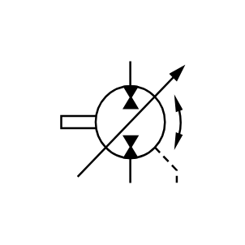

# X11250 Reversible pump/motor

## Definition

```js
{
  _style: {
    entity: 'verticalLabelPosition=bottom;aspect=fixed;html=1;verticalAlign=top;fillColor=strokeColor;align=center;outlineConnect=0;shape=mxgraph.fluid_power.x11250;points=[[0.567,0,0],[0.567,1,0],[0.95,1,0]]',
  },
  _original_width: 97.7,
  _original_height: 93.94,

}
```

## Usage

```js
import { X11250ReversiblePumpMotor } from '@dinghy/standard-components-diagrams/fluidPower'

<X11250ReversiblePumpMotor/>
```

## Preview


