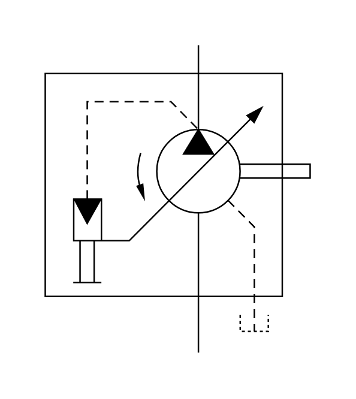

# X11320 Variable-displacement pump

## Definition

```js
{
  _style: {
    entity: 'verticalLabelPosition=bottom;aspect=fixed;html=1;verticalAlign=top;fillColor=strokeColor;align=center;outlineConnect=0;shape=mxgraph.fluid_power.x11320;points=[[0.575,0,0],[0.575,1,0],[0.79,0.93,0]]',
  },
  _width: 176.78,
  _height: 205.22,
}
```

## Usage

```js
import { X11320VariableDisplacementPump } from '@dinghy/standard-components-diagrams/fluidPower'

<X11320VariableDisplacementPump/>
```

## Preview


