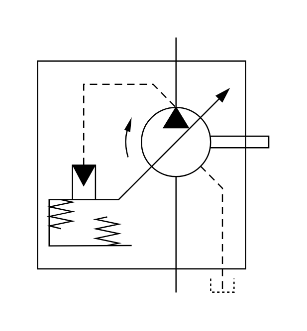

# X11340 Variable-displacement pump

## Definition

```js
{
  _style: {
    entity: 'verticalLabelPosition=bottom;aspect=fixed;html=1;verticalAlign=top;fillColor=strokeColor;align=center;outlineConnect=0;shape=mxgraph.fluid_power.x11340;points=[[0.6,0,0],[0.6,1,0],[0.8,1,0]]',
  },
  _width: 185.84,
  _height: 205.22,
}
```

## Usage

```js
import { X11340VariableDisplacementPump } from '@dinghy/standard-components-diagrams/fluidPower'

<X11340VariableDisplacementPump/>
```

## Preview


