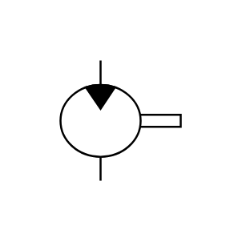

# X11390 Motor

## Definition

```js
{
  _style: {
    entity: 'verticalLabelPosition=bottom;aspect=fixed;html=1;verticalAlign=top;fillColor=strokeColor;align=center;outlineConnect=0;shape=mxgraph.fluid_power.x11390;points=[[0.334,0,0],[0.334,1,0]]',
  },
  _original_width: 83.38,
  _original_height: 92.9,

}
```

## Usage

```js
import { X11390Motor } from '@dinghy/standard-components-diagrams/fluidPower'

<X11390Motor/>
```

## Preview


