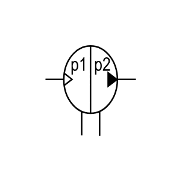

# X11430 Pressure intensifier,

## Definition

```js
{
  _style: {
    entity: 'verticalLabelPosition=bottom;aspect=fixed;html=1;verticalAlign=top;fillColor=strokeColor;align=center;outlineConnect=0;shape=mxgraph.fluid_power.x11430;points=[[0,0.375,0],[1,0.375,0],[0.4,0.99,0],[0.6,1,0]]',
  },
  _original_width: 93.94,
  _original_height: 74.72,

}
```

## Usage

```js
import { X11430PressureIntensifier } from '@dinghy/standard-components-diagrams/fluidPower'

<X11430PressureIntensifier/>
```

## Preview


