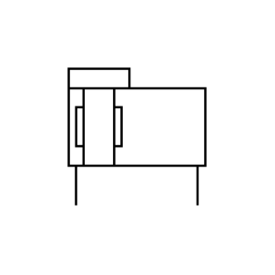

# X11520 Double-acting band-type

## Definition

```js
{
  _style: {
    entity: 'verticalLabelPosition=bottom;aspect=fixed;html=1;verticalAlign=top;fillColor=strokeColor;align=center;outlineConnect=0;shape=mxgraph.fluid_power.x11520;points=[[0.05,1,0],[0.94,1,0]]',
  },
  _original_width: 83.5,
  _original_height: 65.44,

}
```

## Usage

```js
import { X11520DoubleActingBandType } from '@dinghy/standard-components-diagrams/fluidPower'

<X11520DoubleActingBandType/>
```

## Preview


