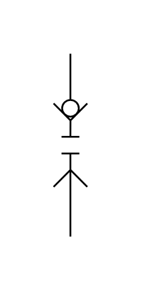

# X11700 Quick-action coupling

## Definition

```js
{
  _style: {
    entity: 'verticalLabelPosition=bottom;aspect=fixed;html=1;verticalAlign=top;fillColor=strokeColor;align=center;outlineConnect=0;shape=mxgraph.fluid_power.x11700;points=[[0.5,0,0],[0.5,1,0]]',
  },
  _width: 18.98,
  _height: 102.78,
}
```

## Usage

```js
import { X11700QuickActionCoupling } from '@dinghy/standard-components-diagrams/fluidPower'

<X11700QuickActionCoupling/>
```

## Preview


