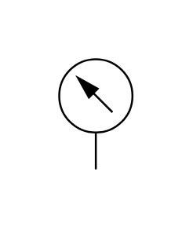

# X11820 Pressure-measuring unit

## Definition

```js
{
  _style: {
    entity: 'verticalLabelPosition=bottom;aspect=fixed;html=1;verticalAlign=top;fillColor=strokeColor;align=center;outlineConnect=0;shape=mxgraph.fluid_power.x11820;points=[[0.5,1,0]]',
  },
  _width: 37.34,
  _height: 56.1,
}
```

## Usage

```js
import { X11820PressureMeasuringUnit } from '@dinghy/standard-components-diagrams/fluidPower'

<X11820PressureMeasuringUnit/>
```

## Preview


