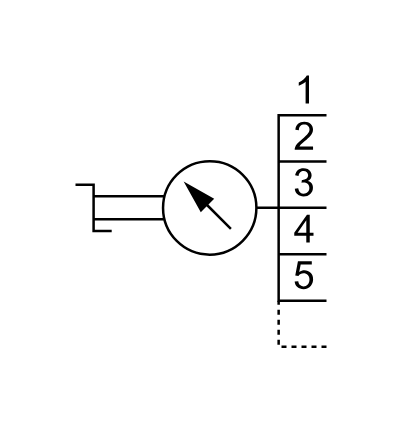

# X11840 Pressure gauge

## Definition

```js
{
  _style: {
    entity: 'verticalLabelPosition=bottom;aspect=fixed;html=1;verticalAlign=top;fillColor=strokeColor;align=center;outlineConnect=0;shape=mxgraph.fluid_power.x11840;points=[[0.07,0.485,0],[1,0.145,0],[1,0.315,0],[1,0.485,0],[1,0.66,0],[1,0.83,0],[1,1,0]]',
  },
  _width: 100.4,
  _height: 108.54,
}
```

## Usage

```js
import { X11840PressureGauge } from '@dinghy/standard-components-diagrams/fluidPower'

<X11840PressureGauge/>
```

## Preview


