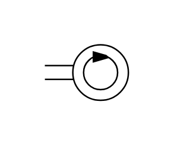

# X11930 Tachometer

## Definition

```js
{
  _style: {
    entity: 'verticalLabelPosition=bottom;aspect=fixed;html=1;verticalAlign=top;fillColor=strokeColor;align=center;outlineConnect=0;shape=mxgraph.fluid_power.x11930;points=[[0,0.375,0],[0,0.625,0]]',
  },
  _width: 56.28,
  _height: 37.42,
}
```

## Usage

```js
import { X11930Tachometer } from '@dinghy/standard-components-diagrams/fluidPower'

<X11930Tachometer/>
```

## Preview


