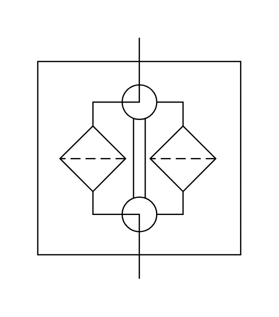

# X12170 Double filter

## Definition

```js
{
  _style: {
    entity: 'verticalLabelPosition=bottom;aspect=fixed;html=1;verticalAlign=top;fillColor=strokeColor;align=center;outlineConnect=0;shape=mxgraph.fluid_power.x12170;points=[[0.5,0,0],[0.5,1,0]]',
  },
  _width: 162.34,
  _height: 192.78,
}
```

## Usage

```js
import { X12170DoubleFilter } from '@dinghy/standard-components-diagrams/fluidPower'

<X12170DoubleFilter/>
```

## Preview


