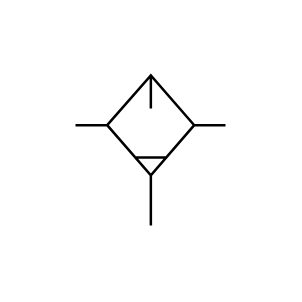

# X12250 Lubricator with

## Definition

```js
{
  _style: {
    entity: 'verticalLabelPosition=bottom;aspect=fixed;html=1;verticalAlign=top;fillColor=strokeColor;align=center;outlineConnect=0;shape=mxgraph.fluid_power.x12250;points=[[0,0.33,0],[1,0.33,0],[0.5,1,0]]',
  },
  _original_width: 90.42,
  _original_height: 78.68,

}
```

## Usage

```js
import { X12250LubricatorWith } from '@dinghy/standard-components-diagrams/fluidPower'

<X12250LubricatorWith/>
```

## Preview


