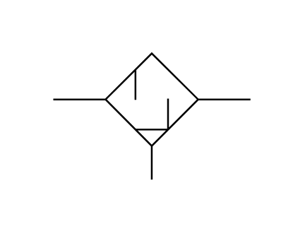

# X12310 Reclassifier with

## Definition

```js
{
  _style: {
    entity: 'verticalLabelPosition=bottom;aspect=fixed;html=1;verticalAlign=top;fillColor=strokeColor;align=center;outlineConnect=0;shape=mxgraph.fluid_power.x12310;points=[[0,0.365,0],[1,0.365,0],[0.5,1,0]]',
  },
  _width: 111.7,
  _height: 71.36,
}
```

## Usage

```js
import { X12310ReclassifierWith } from '@dinghy/standard-components-diagrams/fluidPower'

<X12310ReclassifierWith/>
```

## Preview


