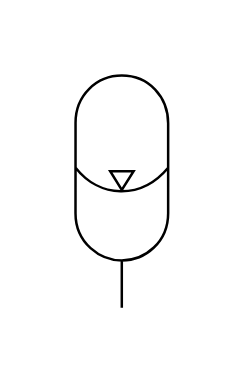

# X12330 Gas-loaded accumulator

## Definition

```js
{
  _style: {
    entity: 'verticalLabelPosition=bottom;aspect=fixed;html=1;verticalAlign=top;fillColor=strokeColor;align=center;outlineConnect=0;shape=mxgraph.fluid_power.x12330;points=[[0.5,1,0]]',
  },
  _width: 37.06,
  _height: 92.92,
}
```

## Usage

```js
import { X12330GasLoadedAccumulator } from '@dinghy/standard-components-diagrams/fluidPower'

<X12330GasLoadedAccumulator/>
```

## Preview


