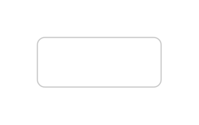
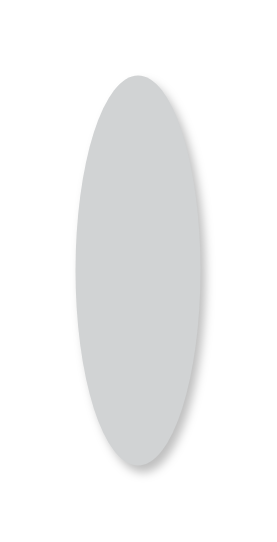
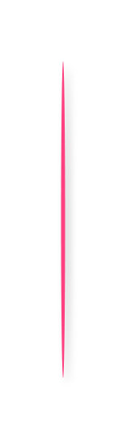
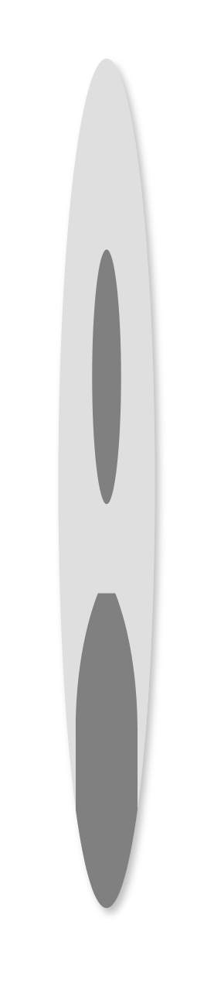
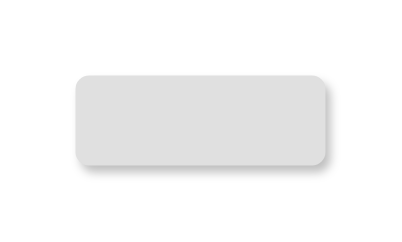
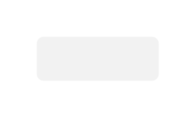
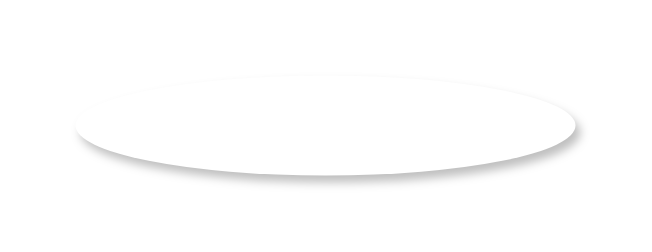

# Gmdl Buttons Entities

- [DropdownButton](./dropdown-button.md)  

- [DropdownButtonEditable](./dropdown-button-editable.md)  

- [DropdownButtonSelectedEditable](./dropdown-button-selected-editable.md)  

- [DropdownMenu](./dropdown-menu.md)  

- [FloatingActionButton](./floating-action-button.md)  

- [FloatingActionButton2](./floating-action-button-2.md)  

- [FloatingActionButtons](./floating-action-buttons.md)  

- [FloatingActionButtons2](./floating-action-buttons-2.md)  

- [FloatingActionButtons3](./floating-action-buttons-3.md)  

- [PersistentFooterButtons](./persistent-footer-buttons.md)  

- [RaisedButtonFocused](./raised-button-focused.md)  

- [RaisedButtonHover](./raised-button-hover.md)  

- [RaisedButtonHover2](./raised-button-hover-2.md)  

- [RaisedButtonNormal](./raised-button-normal.md)  

- [RaisedButtonNormal2](./raised-button-normal-2.md)  

- [RaisedButtonNormal3](./raised-button-normal-3.md)  

- [RaisedButtonNormal4](./raised-button-normal-4.md)  

- [RaisedButtonPressed](./raised-button-pressed.md)  

- [RaisedButtonPressed2](./raised-button-pressed-2.md)  

- [RaisedButtonPressed3](./raised-button-pressed-3.md)  

- [RaisedButtonPressed4](./raised-button-pressed-4.md)  

- [RaisedButtonPressed5](./raised-button-pressed-5.md)  

- [RaisedButtonPressed6](./raised-button-pressed-6.md)  

- [RelatedActions](./related-actions.md)  

- [Toolbar](./toolbar.md)  

