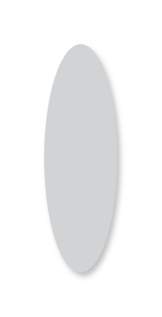

# Floating action buttons

## Definition

```js
{
  _style: {
    entity: 'shape=ellipse;strokeColor=none;fillColor=#D1D3D4;shadow=1;gradientColor=none;sketch=0;hachureGap=4;pointerEvents=0;fontFamily=Architects Daughter;fontSource=https%3A%2F%2Ffonts.googleapis.com%2Fcss%3Ffamily%3DArchitects%2BDaughter;fontSize=20;',
  },
  _width: 50,
  _height: 156,
}
```

## Usage

```js
import { FloatingActionButtons } from '@dinghy/standard-components-diagrams/gmdlButtons'

<FloatingActionButtons/>
```

## Preview


