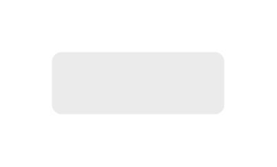

# Raised Button (Hover)

## Definition

```js
{
  _style: {
    entity: 'whiteSpace=wrap;html=1;dashed=0;align=center;fontSize=12;shape=rect;fillColor=#999999;opacity=20;strokeColor=none;fontStyle=1;shadow=0;',
  },
  _width: 100,
  _height: 36,
}
```

## Usage

```js
import { RaisedButtonHover } from '@dinghy/standard-components-diagrams/gmdlButtons'

<RaisedButtonHover/>
```

## Preview


