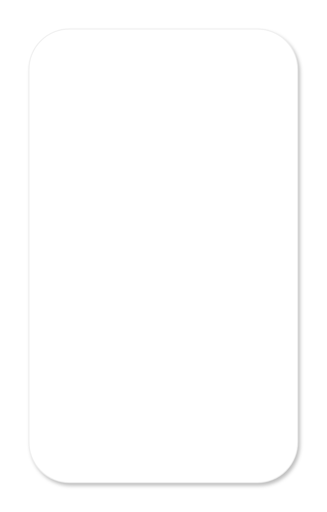

# Dialog with persistent footer button

## Definition

```js
{
  _style: {
    entity: 'dashed=0;shape=rect;fillColor=#ffffff;strokeColor=#eeeeee;shadow=1;',
  },
  _width: 280,
  _height: 472,
}
```

## Usage

```js
import { DialogWithPersistentFooterButton } from '@dinghy/standard-components-diagrams/gmdlDialogs'

<DialogWithPersistentFooterButton/>
```

## Preview


