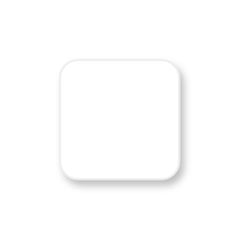

# Message dialog

## Definition

```js
{
  _style: {
    entity: 'dashed=0;shape=rect;fillColor=#ffffff;strokeColor=#eeeeee;shadow=1;whiteSpace=wrap;html=1;',
  },
  _original_width: 480,
  _original_height: 480,

}
```

## Usage

```js
import { MessageDialog } from '@dinghy/standard-components-diagrams/gmdlDialogs'

<MessageDialog/>
```

## Preview


