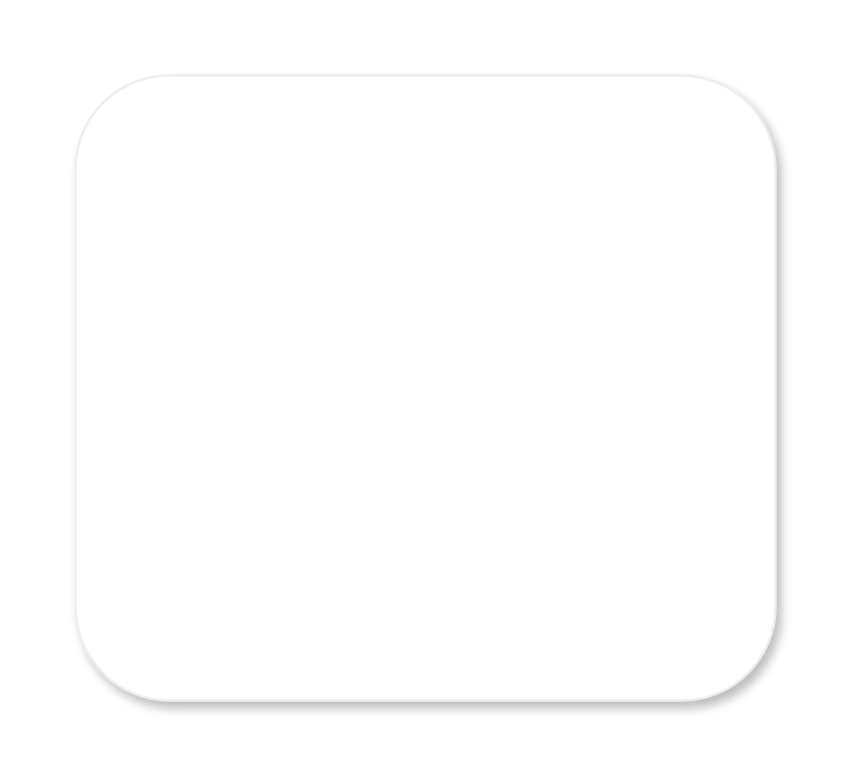

# Simple dialog 2

## Definition

```js
{
  _style: {
    entity: 'shape=rect;fillColor=#ffffff;strokeColor=#eeeeee;shadow=1;fontSize=20;fontColor=#000000;spacingTop=-7;spacing=20;labelPosition=center;align=left;verticalAlign=top;whiteSpace=wrap;html=1;',
  },
  _width: 280,
  _height: 250,
}
```

## Usage

```js
import { SimpleDialog2 } from '@dinghy/standard-components-diagrams/gmdlDialogs'

<SimpleDialog2/>
```

## Preview


