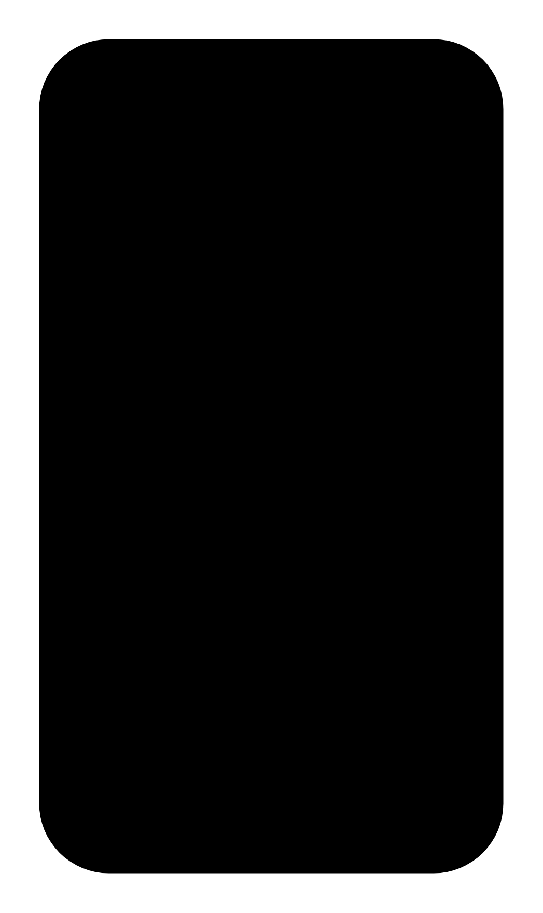

# Two-line grid list

## Definition

```js
{
  _style: {
    entity: 'dashed=0;shape=rect;fillColor=#000000;strokeColor=none;',
  },
  _width: 358,
  _height: 642,
}
```

## Usage

```js
import { TwoLineGridList } from '@dinghy/standard-components-diagrams/gmdlGridLists'

<TwoLineGridList/>
```

## Preview


