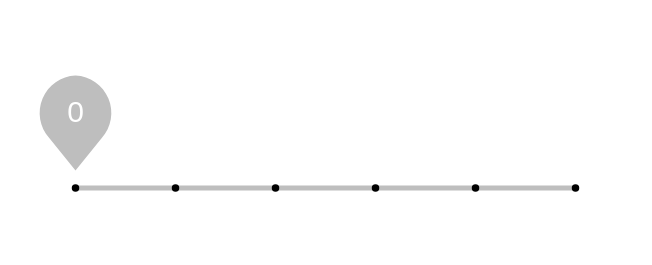

# Discrete slider (click)

## Definition

```js
{
  _style: {
    entity: 'dashed=0;verticalLabelPosition=bottom;verticalAlign=top;align=center;shape=mxgraph.gmdl.sliderDiscreteDots;barPos=0;bright=1;strokeColor=#0F9D58;opacity=100;strokeWidth=2;fillColor=#0F9D58;handleSize=10;shadow=0;fontSize=12;fontColor=#ffffff;html=1;',
  },
  _width: 200,
  _height: 45,
}
```

## Usage

```js
import { DiscreteSliderClick } from '@dinghy/standard-components-diagrams/gmdlSliders'

<DiscreteSliderClick/>
```

## Preview


