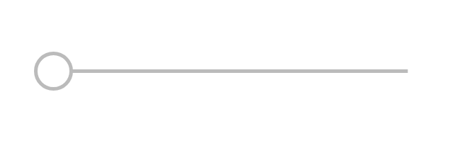

# Slider (click)

## Definition

```js
{
  _style: {
    entity: 'dashed=0;verticalLabelPosition=bottom;verticalAlign=top;align=center;shape=mxgraph.gmdl.slider2;barPos=0;strokeColor=#bbbbbb;opacity=100;strokeWidth=2;handleSize=20;shadow=0;html=1;',
  },
  _width: 200,
  _height: 20,
}
```

## Usage

```js
import { SliderClick } from '@dinghy/standard-components-diagrams/gmdlSliders'

<SliderClick/>
```

## Preview


