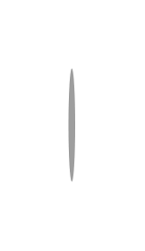
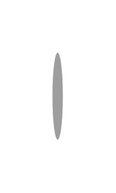

# Gmdl Steppers Entities

- [MobileStepText](./mobile-step-text.md)  

- [MobileVerticalStepper](./mobile-vertical-stepper.md)  

- [Stepper](./stepper.md)  

- [StepperWithAlternativeLabelPlacing](./stepper-with-alternative-label-placing.md)  

- [StepperWithAlternativeLabelPlacing2](./stepper-with-alternative-label-placing-2.md)  

- [StepperWithAlternativeLabelPlacing3](./stepper-with-alternative-label-placing-3.md)  

- [StepperWithAlternativeLabelPlacing4](./stepper-with-alternative-label-placing-4.md)  

- [StepperWithAlternativeLabelPlacing5](./stepper-with-alternative-label-placing-5.md)  

- [StepperWithAlternativeLabelPlacing6](./stepper-with-alternative-label-placing-6.md)  

- [StepperWithAlternativeOptionalLabelPlacing](./stepper-with-alternative-optional-label-placing.md)  

- [StepperWithAlternativeOptionalLabelPlacing2](./stepper-with-alternative-optional-label-placing-2.md)  

- [StepperWithAlternativeOptionalLabelPlacing3](./stepper-with-alternative-optional-label-placing-3.md)  

- [StepperWithAlternativeOptionalLabelPlacing4](./stepper-with-alternative-optional-label-placing-4.md)  

