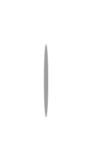

# Stepper with alternative label placing 4

## Definition

```js
{
  _style: {
    entity: 'shape=ellipse;fontSize=12;strokeColor=none;fillColor=#9e9e9e;fontColor=#ffffff;align=center;verticalAlign=middle;html=1;',
  },
  _width: 3,
  _height: 50,
}
```

## Usage

```js
import { StepperWithAlternativeLabelPlacing4 } from '@dinghy/standard-components-diagrams/gmdlSteppers'

<StepperWithAlternativeLabelPlacing4/>
```

## Preview


