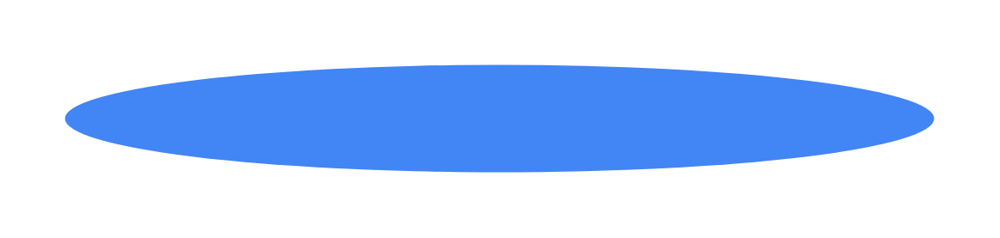

# Stepper with alternative optional label placing

## Definition

```js
{
  _style: {
    entity: 'shape=ellipse;strokeColor=none;fillColor=#4285F4;fontColor=#ffffff;fontSize=12;align=center;verticalAlign=middle;html=1;',
  },
  _width: 404,
  _height: 50,
}
```

## Usage

```js
import { StepperWithAlternativeOptionalLabelPlacing } from '@dinghy/standard-components-diagrams/gmdlSteppers'

<StepperWithAlternativeOptionalLabelPlacing/>
```

## Preview


