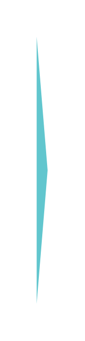

# Arrow List 10

## Definition

```js
{
  _style: {
    entity: 'shape=mxgraph.infographic.ribbonSimple;notch1=0;notch2=10;notch=0;html=1;whiteSpace=wrap;fillColor=#61C6CE;strokeColor=none;shadow=0;fontSize=17;fontColor=#FFFFFF;align=left;spacingLeft=10;fontStyle=1;',
  },
  _width: 9,
  _height: 220,
}
```

## Usage

```js
import { ArrowList10 } from '@dinghy/standard-components-diagrams/infoGraphic'

<ArrowList10/>
```

## Preview


