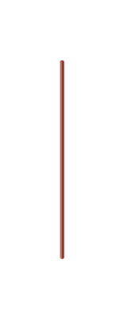

# Bar Graph 3

## Definition

```js
{
  _style: {
    entity: 'verticalLabelPosition=bottom;verticalAlign=top;html=1;shape=mxgraph.infographic.shadedCube;isoAngle=15;fillColor=#AE4132;strokeColor=none;fontStyle=1;fontColor=#AE4132;fontSize=12;shadow=0;',
  },
  _width: 2,
  _height: 100,
}
```

## Usage

```js
import { BarGraph3 } from '@dinghy/standard-components-diagrams/infoGraphic'

<BarGraph3/>
```

## Preview


