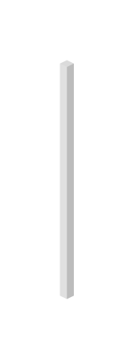

# Bar Graph 8

## Definition

```js
{
  _style: {
    entity: 'verticalLabelPosition=top;verticalAlign=bottom;html=1;shape=mxgraph.infographic.shadedCube;isoAngle=15;fillColor=#CCCCCC;strokeColor=none;fontStyle=1;fontColor=#D82A23;fontSize=12;shadow=0;align=left;opacity=70;',
  },
  _width: 7,
  _height: 120,
}
```

## Usage

```js
import { BarGraph8 } from '@dinghy/standard-components-diagrams/infoGraphic'

<BarGraph8/>
```

## Preview


