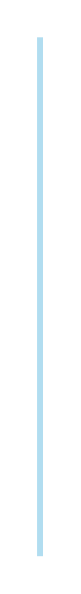

# Chevron list 8

## Definition

```js
{
  _style: {
    entity: 'shape=rect;fillColor=#B1DDF0;strokeColor=none;fontSize=12;html=1;whiteSpace=wrap;align=left;verticalAlign=top;spacing=5;rounded=0;',
  },
  _width: 5,
  _height: 420,
}
```

## Usage

```js
import { ChevronList8 } from '@dinghy/standard-components-diagrams/infoGraphic'

<ChevronList8/>
```

## Preview


