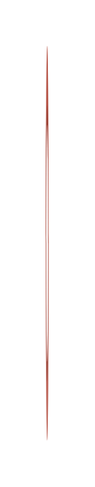

# Circular Dial List (horizontal) 8

## Definition

```js
{
  _style: {
    entity: 'verticalLabelPosition=middle;verticalAlign=middle;html=1;whiteSpace=wrap;shape=mxgraph.infographic.partConcEllipse;startAngle=0;endAngle=0.25;arcWidth=0.4;strokeColor=none;fillColor=#AE4132;fontSize=22;fontColor=#AE4132;align=center;fontStyle=1;',
  },
  _width: 2,
  _height: 260,
}
```

## Usage

```js
import { CircularDialListHorizontal8 } from '@dinghy/standard-components-diagrams/infoGraphic'

<CircularDialListHorizontal8/>
```

## Preview


