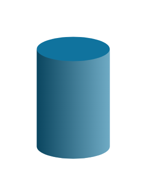

# Cylinder

## Definition

```js
{
  _style: {
    entity: 'verticalLabelPosition=bottom;verticalAlign=top;html=1;shape=mxgraph.infographic.cylinder;fillColor=#10739E;strokeColor=none;',
  },
  _width: 60,
  _height: 100,
}
```

## Usage

```js
import { Cylinder } from '@dinghy/standard-components-diagrams/infoGraphic'

<Cylinder/>
```

## Preview


