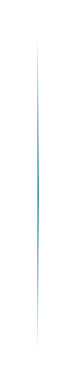

# Percentage list 11

## Definition

```js
{
  _style: {
    entity: 'html=1;shape=mxgraph.infographic.ribbonSimple;notch1=0;notch2=20;fillColor=#10739E;strokeColor=none;align=left;verticalAlign=middle;fontColor=#ffffff;fontSize=18;spacingLeft=10;fontStyle=1;shadow=0;',
  },
  _width: 1,
  _height: 250,
}
```

## Usage

```js
import { PercentageList11 } from '@dinghy/standard-components-diagrams/infoGraphic'

<PercentageList11/>
```

## Preview


