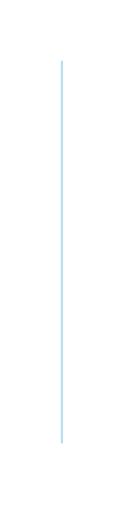

# Percentage list 2

## Definition

```js
{
  _style: {
    entity: 'whiteSpace=wrap;html=1;fixedSize=1;size=10;fillColor=#B1DDF0;strokeColor=none;',
  },
  _width: 1,
  _height: 190,
}
```

## Usage

```js
import { PercentageList2 } from '@dinghy/standard-components-diagrams/infoGraphic'

<PercentageList2/>
```

## Preview


