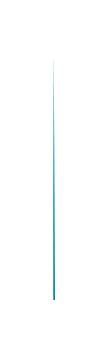

# Pyramid Graph 2

## Definition

```js
{
  _style: {
    entity: 'verticalLabelPosition=bottom;verticalAlign=top;html=1;shape=mxgraph.infographic.shadedPyramid;fillColor=#12AAB5;strokeColor=none;fontSize=10;labelPosition=center;align=center;shadow=0;',
  },
  _width: 1,
  _height: 140,
}
```

## Usage

```js
import { PyramidGraph2 } from '@dinghy/standard-components-diagrams/infoGraphic'

<PyramidGraph2/>
```

## Preview


