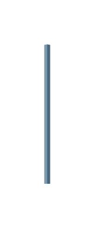

# Step Pyramid 5

## Definition

```js
{
  _style: {
    entity: 'html=1;shape=mxgraph.infographic.pyramidStep;fillColor=#5D7F99;strokeColor=none;shadow=0;',
  },
  _width: 4,
  _height: 95,
}
```

## Usage

```js
import { StepPyramid5 } from '@dinghy/standard-components-diagrams/infoGraphic'

<StepPyramid5/>
```

## Preview


