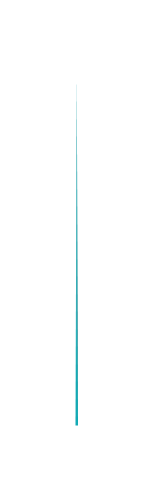

# Triangle Graph 2

## Definition

```js
{
  _style: {
    entity: 'verticalLabelPosition=middle;verticalAlign=bottom;html=1;whiteSpace=wrap;shape=mxgraph.infographic.shadedTriangle;fillColor=#12AAB5;strokeColor=none;fontSize=10;labelPosition=center;align=center;fontColor=#FFFFFF;fontStyle=1;shadow=0;',
  },
  _width: 1,
  _height: 140,
}
```

## Usage

```js
import { TriangleGraph2 } from '@dinghy/standard-components-diagrams/infoGraphic'

<TriangleGraph2/>
```

## Preview


