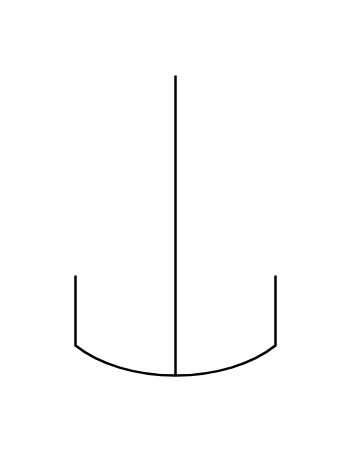
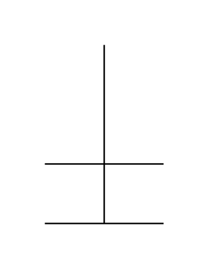
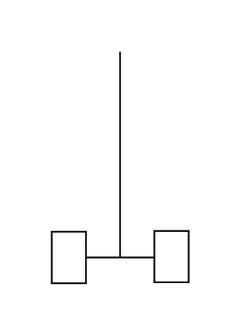
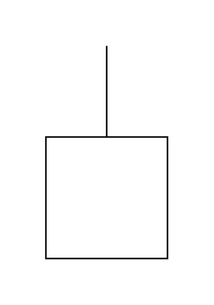
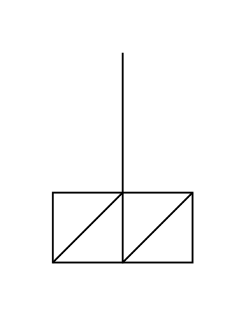
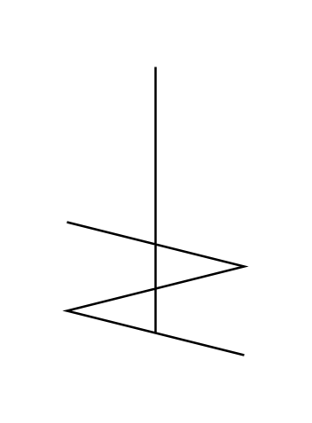
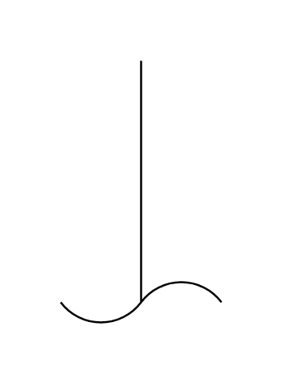
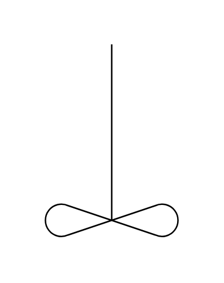
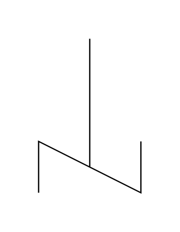

# Proc Eng Agitators Entities

- [AgitatorAnchor](./agitator-anchor.md)  

- [AgitatorCrossBeam](./agitator-cross-beam.md)  

- [AgitatorDisc](./agitator-disc.md)  

- [AgitatorFlateBladePaddle](./agitator-flate-blade-paddle.md)  

- [AgitatorGatPaddle](./agitator-gat-paddle.md)  

- [AgitatorHelical](./agitator-helical.md)  

- [AgitatorImpeller](./agitator-impeller.md)  

- [AgitatorPropeller](./agitator-propeller.md)  

- [AgitatorTurbine](./agitator-turbine.md)  

- [AgitatorStirrer](./agitator-stirrer.md)  

