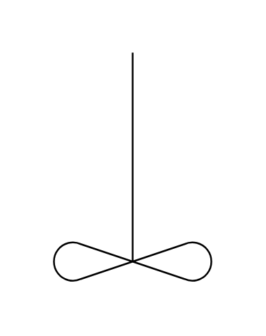

# Agitator (Propeller)

## Definition

```js
{
  _style: {
    entity: 'shape=mxgraph.pid.agitators.agitator_(propeller);html=1;pointerEvents=1;align=center;verticalLabelPosition=bottom;verticalAlign=top;dashed=0;',
  },
  _width: 92,
  _height: 132,
}
```

## Usage

```js
import { AgitatorPropeller } from '@dinghy/standard-components-diagrams/procEngAgitators'

<AgitatorPropeller/>
```

## Preview


