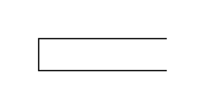

# Support Ring

## Definition

```js
{
  _style: {
    entity: 'shape=mxgraph.pid.apparatus_elements.support_ring;html=1;pointerEvents=1;align=center;verticalLabelPosition=bottom;verticalAlign=top;dashed=0;',
  },
  _width: 100,
  _height: 25,
}
```

## Usage

```js
import { SupportRing } from '@dinghy/standard-components-diagrams/procEngApparatusElements'

<SupportRing/>
```

## Preview


