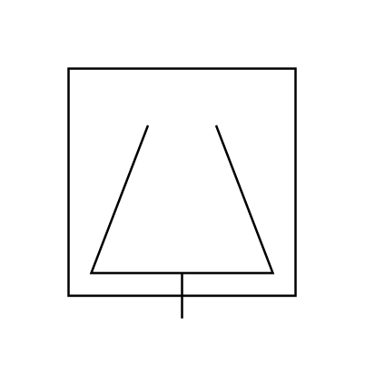

# Centrifuge (High Speed)

## Definition

```js
{
  _style: {
    entity: 'shape=mxgraph.pid.centrifuges.centrifuge_(high_speed);html=1;pointerEvents=1;align=center;verticalLabelPosition=bottom;verticalAlign=top;dashed=0;',
  },
  _width: 100,
  _height: 110,
}
```

## Usage

```js
import { CentrifugeHighSpeed } from '@dinghy/standard-components-diagrams/procEngCentrifuges'

<CentrifugeHighSpeed/>
```

## Preview


