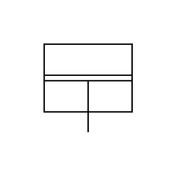

# Reciprocating Compressor 2

## Definition

```js
{
  _style: {
    entity: 'verticalLabelPosition=bottom;outlineConnect=0;align=center;dashed=0;html=1;verticalAlign=top;shape=mxgraph.pid.compressors.reciprocating_compressor_2',
  },
  _original_width: 50,
  _original_height: 65,

}
```

## Usage

```js
import { ReciprocatingCompressor2 } from '@dinghy/standard-components-diagrams/procEngCompressors'

<ReciprocatingCompressor2/>
```

## Preview


